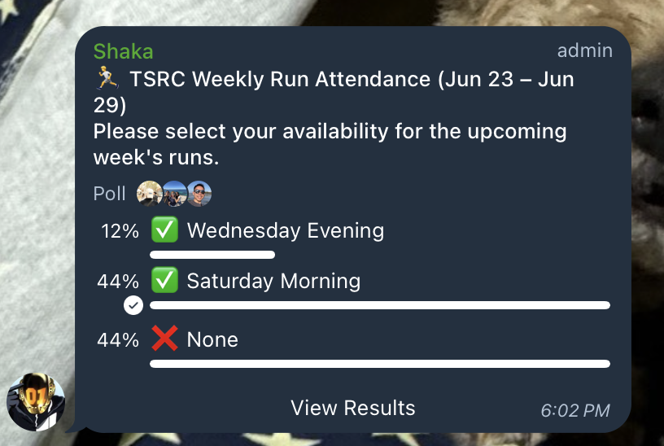
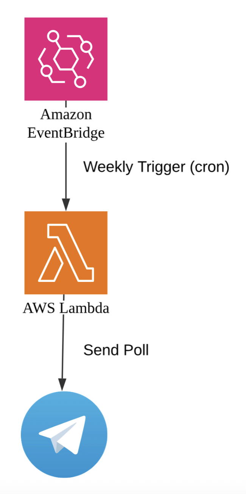
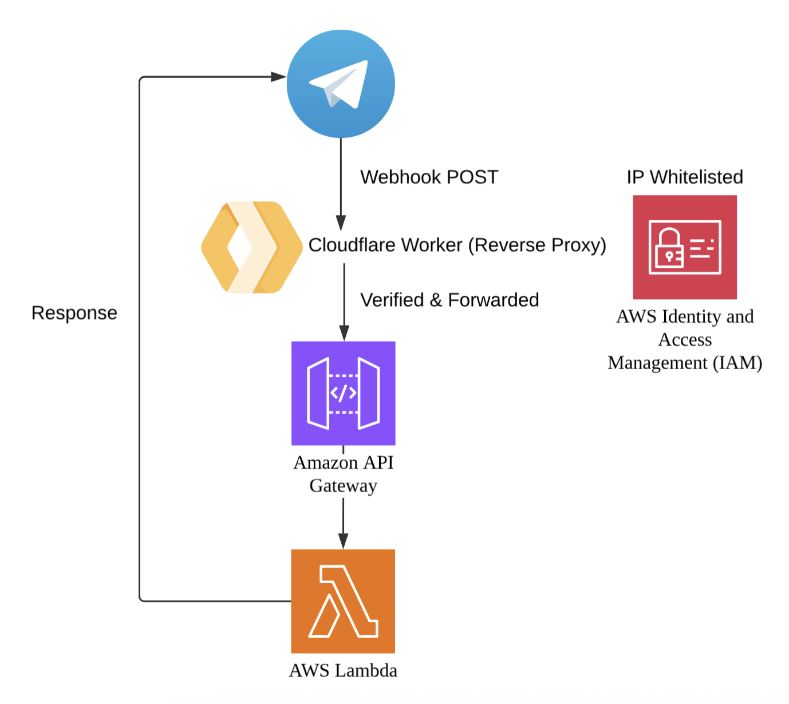
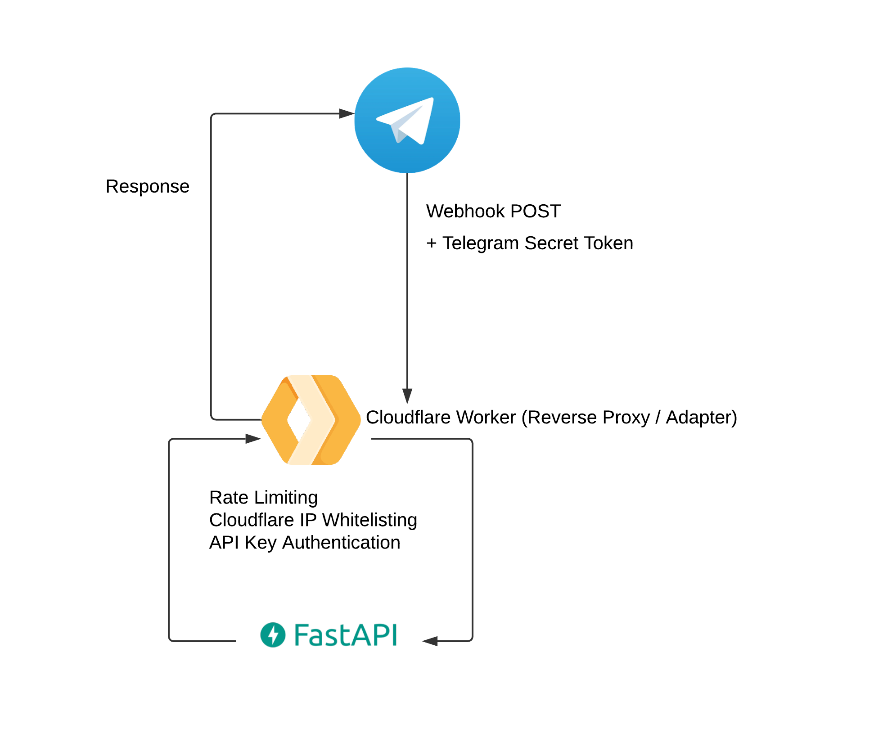

# 🤖⚙️ `sh-vegapunk`

  

  <code>sh-vegapunk</code> is modeled after <strong>Vegapunk</strong> from the One Piece.

## 🚀 Satellites Available

### ✅ SHAKA! (Telegram Poll Dispatcher)

  

`SHAKA` launches a **weekly poll every Sunday night** in a Telegram group to collect running attendance availability for the upcoming week. 

#### Architecture

  

**Tech Stack:**
- **Compute:** AWS Lambda (Python 3.13)
- **Scheduling:** AWS EventBridge (weekly trigger)
- **Deployment:** Terraform + GitHub Actions

---

### ✅ LILITH! (Bill Splitter)

  

`LILITH` helps groups to split bills with ease. **Simply input who paid what, and it will automatically calculate how much everyone owes - and who needs to pay whom to settle up.** Perfect for shared meals.

#### Architecture

  

**Tech Stack:**
- **Compute:** AWS Lambda (Python 3.13)
- **Webhook Endpoint:** AWS API Gateway (REST API)
- **Reverse Proxy:** Cloudflare Worker
  - **Runtime:** JavaScript
  - **CLI Tool:** Wrangler (Cloudflare's deployment tool)
  - **Package Manager:** npm/Node.js
- **Deployment:** Terraform + GitHub Actions

#### Security Features
- **IP Whitelisting:** API Gateway protected by resource policy allowing only [Cloudflare IP ranges](https://www.cloudflare.com/ips/)
- **Secret Verification:** Worker validates `X-Telegram-Bot-Api-Secret-Token` header
- **Hidden Endpoint:** AWS API endpoint never exposed directly to Telegram

---

### ✅ EDISON! (WEATHER APP)

  

`EDISON` lets you know what the current weather is like over at a specified location! **Simply send him a place/town/location in Singapore, and it will automatically check for you using popular weather APIs like `Tomorrow.io` or `Google Weather API`!** If the location you specified isn't supported, please let me know!

#### Architecture

  

**Tech Stack:**
- **Reverse Proxy / Adapter:** Cloudflare
  - **Runtime:** JavaScript
  - **CLI Tool:** Wrangler (Cloudflare's deployment tool)
  - **Package Manager:** npm/Node.js
- **Webhook Endpoint:** [FastAPI (sh-nami)](https://github.com/haojunsng/sh-nami)

#### Security Features
- **IP Whitelisting:** `sh-nami` API only allowlisted only [Cloudflare IP ranges](https://www.cloudflare.com/ips/)
- **Secret Verification:** Worker validates `X-Telegram-Bot-Api-Secret-Token` header
- **API Key Authentication**: `sh-nami` API requires a valid secret API key (`X-API-KEY` header) to authorise incoming requests, ensuring that only trusted clients can call the weather service.

---

## 🛠️ Infrastructure & Deployment

The current setup follows a **serverless-first** approach with infrastructure defined as code:

| Component          | Technology           | Purpose                                |
|--------------------|----------------------|----------------------------------------|
| Application Logic  | Python 3.13      | Bot business logic and weather API    |
| Compute Runtime    | AWS Lambda           | Serverless function execution          |
| Event Scheduling   | AWS EventBridge      | Cron-based trigger for polls           |
| API Gateway        | AWS API Gateway      | REST API endpoint for webhooks         |
| Security Layer     | Cloudflare Workers   | Reverse proxy with IP whitelisting     |
| Configuration      | Environment Variables| Secure token and chat ID management    |
| Infrastructure     | Terraform            | Infrastructure as Code (IaC)           |
| CI/CD              | GitHub Actions       | Automated deployment pipeline          |
| Backend API            | FastAPI       | Weather data processing and response     |

---
