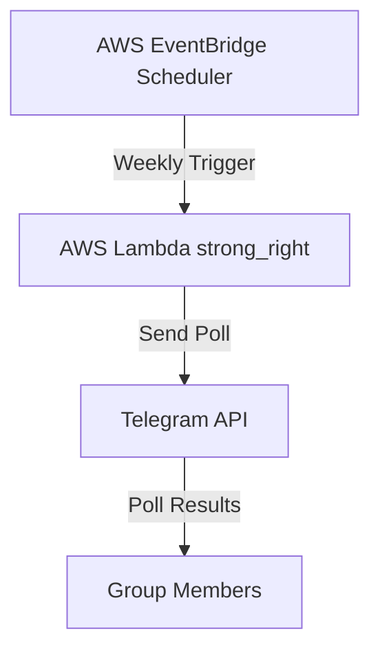
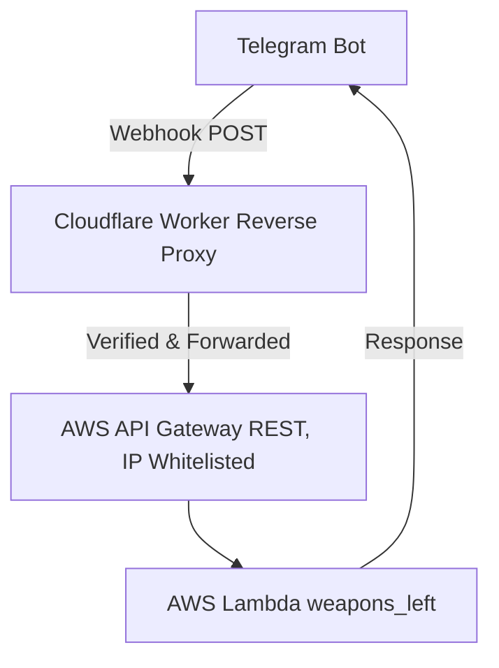

# 🤖⚙️ `data_robot`
*"SUPER!!!"*

`data_robot` is modeled after **Franky** from the Straw Hat Pirates. While Franky builds ships, this one builds bots.

Right now, `data_robot` is docked with two working arms:

---

## 🚀 Current Abilities

### ✅ STRONG-RIGHT! (Telegram Poll Dispatcher)

  

`strong_right` launches a **weekly poll every Sunday night** in a Telegram group to collect running attendance availability for the upcoming week. 

#### Architecture

**Tech Stack:**
- **Compute:** AWS Lambda (Python 3.13)
- **Scheduling:** AWS EventBridge (weekly trigger)
- **Deployment:** Terraform + GitHub Actions

---

### ✅ WEAPONS-LEFT! (Bill Splitter)

  
  

`weapons_left` helps groups to split bills with ease. **Simply input who paid what, and it will automatically calculate how much everyone owes - and who needs to pay whom to settle up.** Perfect for shared meals.

#### Architecture

**Tech Stack:**
- **Compute:** AWS Lambda (Python 3.13)
- **Webhook Endpoint:** AWS API Gateway (REST API)
- **Reverse Proxy:** Cloudflare Worker
  - **Runtime:** JavaScript (V8 engine)
  - **CLI Tool:** Wrangler (Cloudflare's deployment tool)
  - **Framework:** Hono (lightweight web framework for edge runtimes)
  - **Package Manager:** npm/Node.js
- **Deployment:** Terraform + GitHub Actions

#### Security Features
- **IP Whitelisting:** API Gateway protected by resource policy allowing only [Cloudflare IP ranges](https://www.cloudflare.com/ips/)
- **Secret Verification:** Worker validates `X-Telegram-Bot-Api-Secret-Token` header
- **Hidden Endpoint:** AWS API endpoint never exposed directly to Telegram

---

## 🛠️ Infrastructure & Deployment

The current setup follows a **serverless-first** approach with infrastructure defined as code:

| Component          | Technology           | Purpose                                |
|--------------------|----------------------|----------------------------------------|
| Application Logic  | Python 3.13          | Bot business logic and Telegram API    |
| Compute Runtime    | AWS Lambda           | Serverless function execution          |
| Event Scheduling   | AWS EventBridge      | Cron-based trigger for polls           |
| API Gateway        | AWS API Gateway      | REST API endpoint for webhooks         |
| Security Layer     | Cloudflare Workers   | Reverse proxy with IP whitelisting     |
| Configuration      | Environment Variables| Secure token and chat ID management    |
| Infrastructure     | Terraform            | Infrastructure as Code (IaC)           |
| CI/CD              | GitHub Actions       | Automated deployment pipeline          |

---
